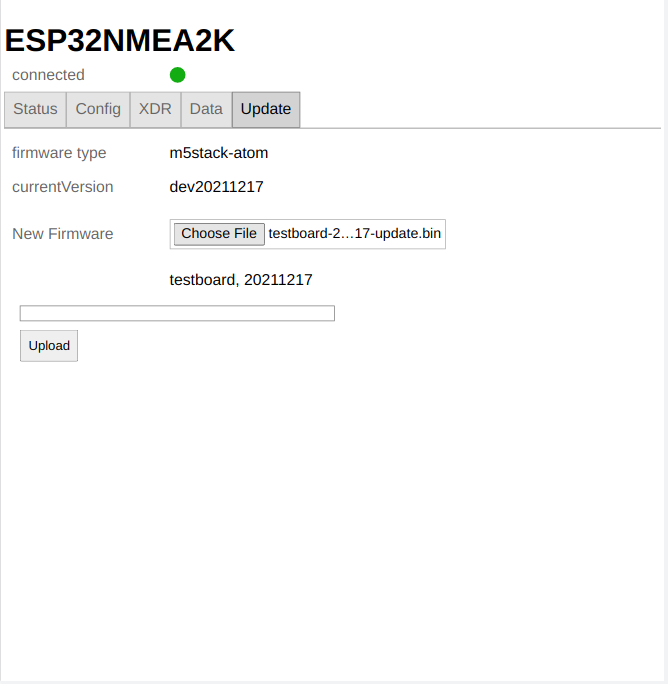

NMEA2000-Gateway with ESP32
===========================

Based on the work of 
* [Homberger](https://github.com/AK-Homberger/NMEA2000WifiGateway-with-ESP32) 
* [Timo Lappalainen](https://github.com/ttlappalainen/NMEA2000)
* [Arno Duvenhage](https://github.com/aduvenhage/ais-decoder)
and a couple of other open source projects.
Many thanks for all the great work.

This project is part of [OpenBoatProjects](https://open-boat-projects.org/de/nmea2000-gateway-mit-m5stack-atom/).

Important Hint
--------------

Although the term NMEA2000 is used here, the software or device is __not a certified NMEA2000 device__ as it did not pass any approval process.
There are chances that the software / device does not follow the NMEA2000 specification at several points.
If you connect the device to your NMEA2000 network you do this on your own risk.

Goal
----
Have a simple ready-to-go ESP32 binary that can be flashed onto a [M5 Atom CAN](https://docs.m5stack.com/en/atom/atom_can), potentially extended by an [Atom Tail485](https://shop.m5stack.com/collections/atom-series/products/atom-tail485?variant=32169041559642) for NMEA0183 connection and power supply.

But will also run on other ESP32 boards see [Hardware](doc/Hardware.md).

What is included
----------------------------------
* a NMEA2000 to Wifi (NMEA0183) gateway
* a NMEA2000 to USB (NMEA0183) gateway
* a NMEA0183 Multiplexer 
  * Wifi to Wifi
  * Wifi to USB
  * Wifi to RS485
  * and reverse
* a NMEA0183 RS485 to NMEA2000 gateway
* a Wifi (NMEA0183) to NMEA2000 gateway
* an USB (NMEA0183) to NMEA2000 gateway
* a WEB UI to configure the gateway and to show the data that has been received
* a USB Actisense to NMEA2000 gateway
* a NMEA2000 to USB Actisense gateway

For the details of the mapped PGNs and NMEA sentences refer to [Conversions](doc/Conversions.pdf).

Hardware
--------
The software is prepared to run on different kinds of ESP32 based modules and accessoirs. For some of them prebuild binaries are available that only need to be flashed, others would require to add some definitions of the used PINs and features and to build the binary.
For the list of hardware set ups refer to [Hardware](doc/Hardware.md).


Installation
------------
In the [release section](../../releases) you can find a couple of pre-build binaries.<br>
They are devided into binaries for an initial flash (xxx-all.bin) and binaries for updating an existing device (xxx-update.bin).

Initial Flash
*************
To initially flash a deviceyou can use [ESPTool](https://github.com/espressif/esptool).
The flash command must be (example for m5stack-atom):

```
esptool.py --port XXXX --chip esp32 write_flash 0x1000  m5stack-atom-20211217-all.bin
```
For the meaning of the board names have a look at [Hardware](doc/Hardware.md). For details refer to the code in [platformio.ini](platformio.ini) and look for the hardware definitions in [GwHardware.h](lib/hardware/GwHardware.h).
Additionally there is a small GUI for the esptool included here at [tools/flashtool/flashtool.py](tools/flashtool/flashtool.py)

__linux users__<br>
You can typically install the esptool (once you have python 3 installed) with
```
sudo pip install esptool
```
To use the flashtool just download [flashtool.pyz](../../raw/master/tools/flashtool.pyz).
```
sudo pip install tkinter
sudo pip install pyserial
```
Afterwards run flashtool.pyz with
```
python3 flashtool.pyz
```

__windows users__<br> 
You can find a prebuild executable in tools: [esptool.exe](tools/esptool.exe).
Just create an empty directory on your machine, download the esptool to this directory and also download the binary (xxx-all.bin) from [releases](../../releases).
Afterwards you need to install the driver for the serial port to connect your ESP32 board. For a modern windows the driver at [FTDI](https://ftdichip.com/drivers/d2xx-drivers/) should be working.
After installing the driver check with your device manager for the com port that is assigned to your connected esp device.

Open a command prompt and change into the directory you downloaded the esptool.exe and the firmware binary.
Flash with the command
```
esptool.exe --port COM3 write_flash 0x1000 xxxxx-xxxx-all.bin
```
Replace COM3 with the port shown in the device manager and the xxx with the name of the downloaded binary.

If you do not want to use the command line there is a tool with an UI that allows you to flash the initial or update firmware.
Just download the exe for your windows system from the [ESP32N2K-Flasher Git Repository](https://github.com/wellenvogel/esp32n2k-flasher/releases/latest).
There is no installation needed - just start the downloaded exe.
Some Anti Virus Software may (accidently) tag this as infected. In this case you can still install the UI in two steps:
 *  you first need to install python3 from the [download page](https://www.python.org/downloads/windows/) - use the Windows 64 Bit installer. Install using the default settings. 
*  Afterwards download [flashtool.pyz](../../raw/master/tools/flashtool.pyz) and run it with a double click.


Update
******
To update a device you can use the Web-UI (Update tab). In principle you could also update a device using the initial flash command (and an xxx-all.bin) firmware but this would erase all your configuration.
So for normal operation just download a xxx-update.bin from the [release](../../releases) page and use the UI to install it.

.

When you choose a file for the update the UI will check if it is a valid firmware file and will reject invalid ones.
To really execute the update click the "Upload" button. You will have a progress indicator and get a notification about the update result.
Please reload the page in your browser after the "connected" state is green as the new version could have changes thatv otherwise will not work.

Starting
---------
After flushing a wifi access point is created. Connect to it (name: ESP32NMEA2K, password: esp32nmea2k).
Afterwards use a Bonjour Browser, the address ESP32NMEA2k.local or the ip address 192.168.15.1 to connect with your browser.
You will get a small UI to watch the status and make settings.
If you want to connect to another wifi network, just enter the credentials in the wifi client tab and enable the wifi client.
For all the potential inputs and outputs (NMEA2000, USB, TCP, RS485) you can set the configuration including NMEA0183 filtering.
To store your changes you will be asked for an admin password. The initial one is esp32admin. You can change this password at the config/system tab (and even completely disable it).
Be careful to notice the password - you can only recover from a lost password with a factory reset of the device (long press the led button until it goes blue->red->green).
On the data page you will have a small dashboard for the currently received data.
On the status page you can check the number of messages flowing in and out.
To help you recover lost passwords the Wifi access point passowrd and the admin password will be output at the USB port when the device starts up. So by connecting a terminal program you can retrieve those passwords.

Security Hints
--------------
You should only connect the Wifi of the device to trusted networks. There is only some very limited protection against network sniffing of denial of service attacks. Never connect the device directly to the internet without a firewall in between (like e.g. your Wifi or LTE router). Especially be careful when connecting to open port networks.
When making changes you will be asked for the admin password - and this one is always send somehow encrypted. But when you change the Wifi access point password or the Wifi client password it will be sent in clear text.
When you enable the "remember me" for the admin password it will be stored in clear text in your browser (use ForgetPassword to remove it from there).

Conversion from and to NMEA0183 XDR
-----------------------------------
The gateway can convert a lot of NMEA 2000 PGNs that have no direct NMEA0183 equivalent to NMEA0183 XDR records. For details refer to [XdrMappings](doc/XdrMappings.md)

Development Environment
-----------------------
[PlatformIO](https://platformio.org/).


Extending the Software
----------------------
To give room for adding own software and still being able to keep in sync with this master part there is a concept of user tasks that will allow you to add your own hardware definitions and to add code that should be executed without the need to change parts of the existing software.
For details refer to the [example description](lib/exampletask/Readme.md).

Changelog
---------
[20220301](../../releases/tag/20220301)
*********
* change [boat data names to shorter ones](../../issues/17) 
* correct [bug with boatData config items](../../issues/16)
* allow for shorter conditions in config items (use arrays of allowed values for "or" condition)
* add some static variables at BoatData to reference the known items (see [exampletask](lib/exampletask/exampletask.cpp#L95))
* make the known config names static members of GwConfigHandler
* remove unused AWD boat data item

[20220124](../../releases/tag/20220124)
*********
* make the serial input and output working again
[20220114](../../releases/tag/20220114)
*********
* incorporate some changes from [Homberger](https://github.com/AK-Homberger/NMEA2000-AIS-Gateway) to improve AIS compatibility with Raymarine displays
* introduce a global switch to prevent sending out converted NMEA2000 data
* extension API improvements (hide config values, set config values)

[20220112](../../releases/tag/20220112)
*********
* correctly send out seasmart if NMEA out is not configured
* enable TCP keepalive on connections to reconnect on failures
[20220109](../../releases/tag/20220109)
********
* allow to set the log level in config

[20220107](../../releases/tag/20220107)
********
* add a TCP client - you can connect to any source of NMEA data using IP address (or MDNS host name) and port<br>
This way you can e.g. "chain" multiple gateways
* add receiving of Seasmart messages.<br>
Using this feature you can forward the data from the NMEA2000 bus via TCP to another device.
* add some Status Info to the extension API
* correct the display of wind direction on the data page

[20211218](../../releases/tag/20211218)
********
* 1st real release
* use the initial flash if you had the pre-release installed
* most of the N2K <-> 0183 conversions working, see [Conversions](doc/Conversions.pdf)
* display of received data
* xdr record mapping (see [XdrMappings](doc/XdrMappings.md))
* OTA update included in the UI
* description updated
* extension API

[20211113](../../releases/tag/20211113)
********
* Pre-release
* basic functions are working


