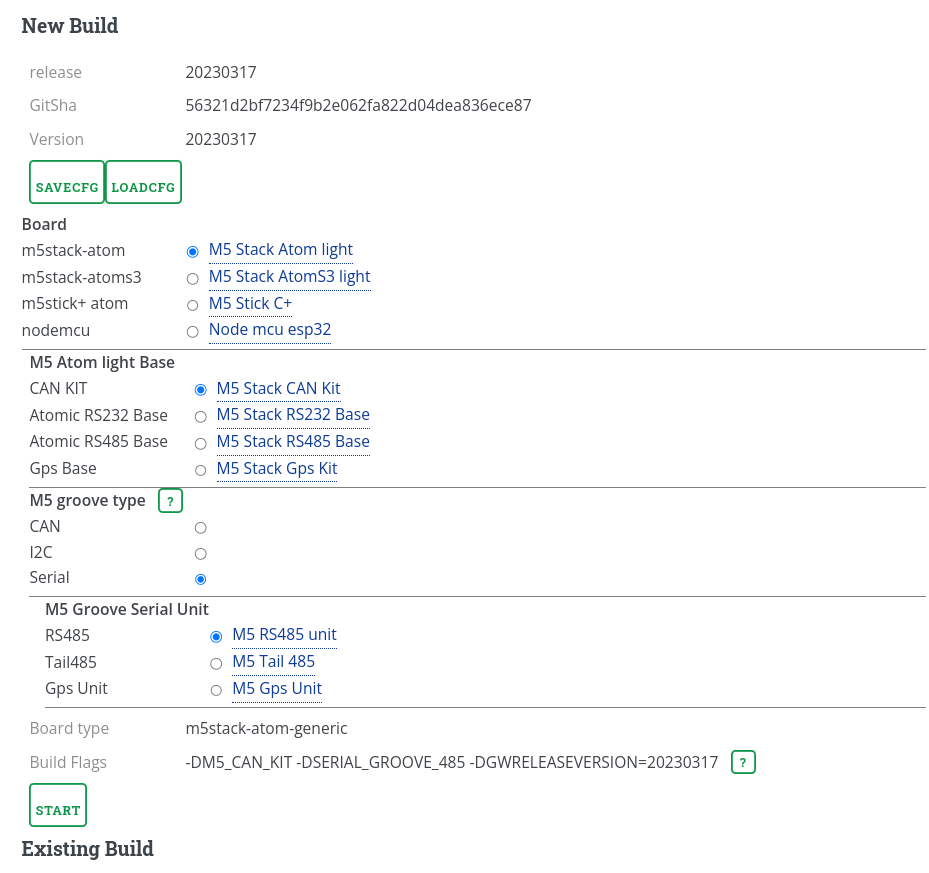
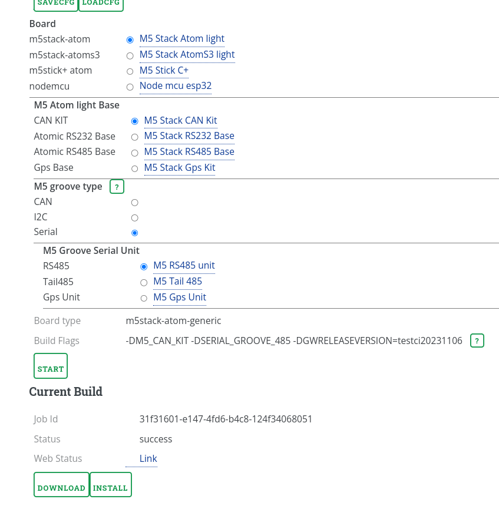

Online Build Service
--------------------
As the supported hardware combinations are already a lot and to support the suage of the converter also in your own designs there is an online build service available that will allow you to select the hardware combinations you would like to have and to start a build.

__Access__

To access the build service go to [wellenvogel.de](https://www.wellenvogel.net/software/esp32/cibuild.html).
To prevent the build service from being misused you need to authenticate with a username and password.
 * User: ESP32NMEA2K
 * Pass: esp32ci

Just consider that the user and password could change in the future - so when bookmarking just always start here and check for the current username and password.

__Workflow__

On the page you select the Hardware combination that fits your needs.
. 

The selected board type and the build flags will be show at the bottom.
Whenever an existing build with the same parameters is found it will be shown and you will be able to download the build results - or directly go to the [WebInstaller](https://www.wellenvogel.net/software/esp32/install.html).
If there is no existing build the "Start" button is active and you can trigger a build.

At the bottom you see the status of the build and you get a link to the [used build service](https://app.circleci.com/pipelines/github/wellenvogel/esp32-nmea2000).

. 

Once the build is complete you will get the buttons to download the results or directly use them for the web installer.

__Build Results__

The build result is always a zip file that contains a flash for the initial installation, an flash for the update installation and the used configuration for the build.
This zip file should be stored on your side as the build results will be deleted after 30 days.
If you later on would like to update with a new release you can upload your configuration using the "LOADCFG" button (either the zip file or the json file from within the zip).
You can also separately store the configuration of your build using the "SAVECFG" button.

__Hardware__

Currently a couple of different hardware configurations are supported. For M5 devices you typically select the processor unit, the "base" and some groove units.
For other node mcu boards you can freely configure the peripherals that you would like to connect.

__Local Build__

As the selection of hardware is basically controlled by defines (-D flags on the command line) you can also use the build GUI to create a build command that you run locally (assumimng you have the build environment installed).
Just click the "?" button beside "Build Flags". The PopUp will give you a "Copy" button that will copy the complete command line you can use for the build.

__Remarks__

Although the online build service tries to make a couple of checks to prevent impossible hardware configurations you still need to check your design (especially if you are using the "free" nodemcu settings).
The free build service at [CircleCi](https://circleci.com/) has a couple of limitation - so please be careful and avoid too many bauilds that you potentially don't need.
