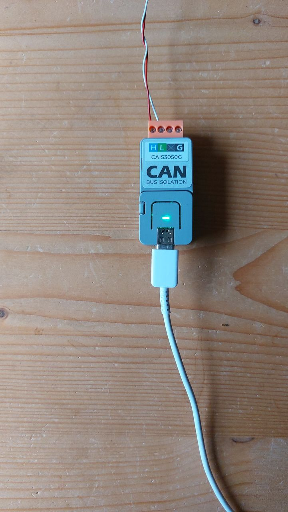
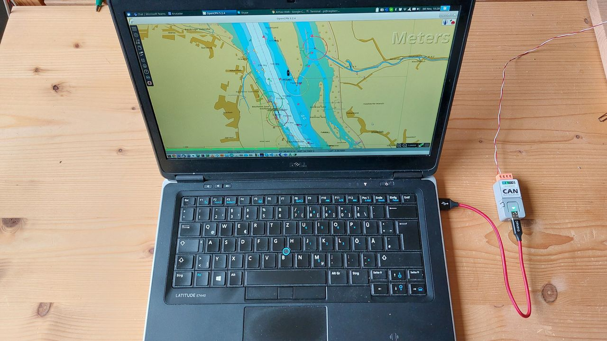
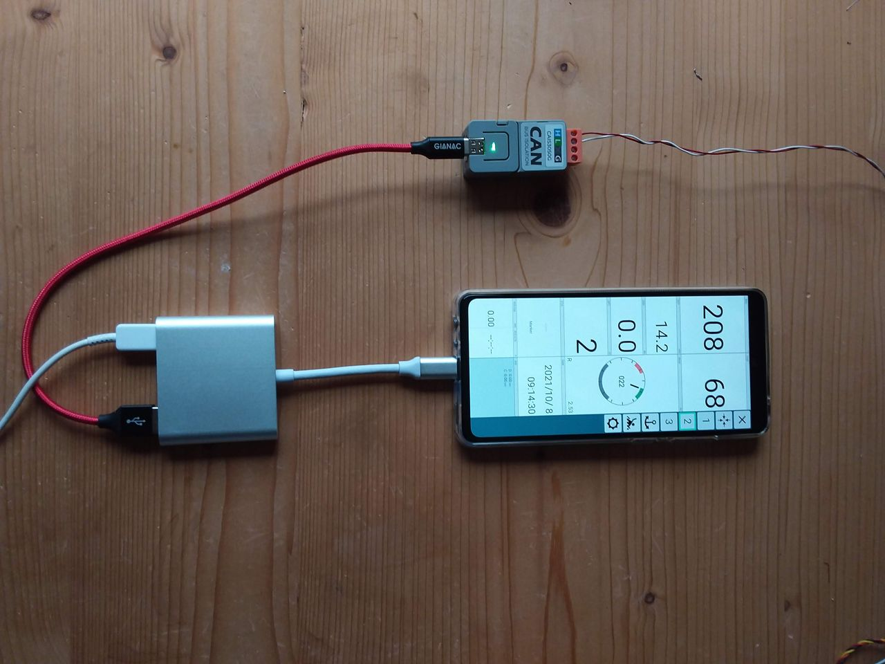
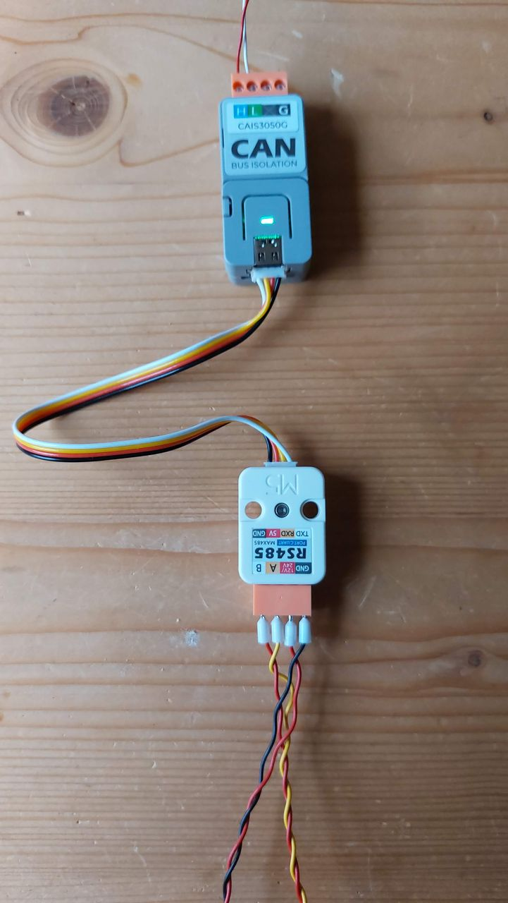
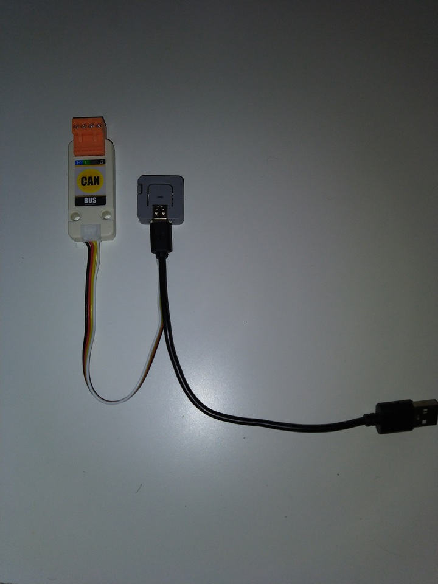
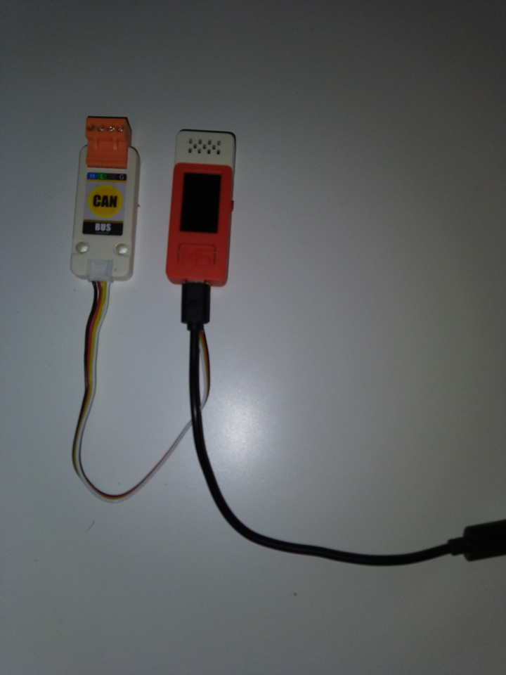

Hardware Configurations
=======================
This pages describes a couple of the potential hardware configurations you could use with the code.
Finally this list is not complete and you can easily define your own set up by adding definitions.
Hint: all prebuild binaries can be found at [releases](https://github.com/wellenvogel/esp32-nmea2000/releases).
The "Build Defines" describe which of the hardware definitions from [Hardware.h](../lib/hardware/Hardware.h) are used.

M5 Atom CAN
-----------
*  Hardware: [M5 AtomCAN](https://docs.m5stack.com/en/atom/atom_can)
*  Prebuild Binary: m5stack-atom-all.bin
*  Build Define: BOARD_M5ATOM
*  Power: via USB

Can be used e.g. as an NMEA2000 Adapter for a laptop running e.g. OpenCPN with the NMEA2000 Data converted to NMEA0183.

Or you can use it as an Adapter for an Android Device running e.g. AvNav.

Beside the connection via USB it can also be used via Wifi - you just need to power the Device via the USB port.
A long press on the LED button (until the led changes color from green via blue to red) will perform a factory reset.

M5 Atom CAN with M5 Tail485
---------------------------
* Hardware: [M5 AtomCAN](https://docs.m5stack.com/en/atom/atom_can) + [M5 Tail485](https://shop.m5stack.com/collections/atom-series/products/atom-tail485?variant=32169041559642)
* Prebuild Binary: m5stack-atom-all.bin
* Build Define: BOARD_M5ATOM
* Power: 12V via Tail485

With this set up you can use the device as a gateway between NMEA2000 and NMEA0183. The NMEA0183 connection can only work as either a sender or receiver. Additionally you can connect other devices via Wifi.
This way you get a simple 12V powered NMEA2000-NMEA0183 Wifi gateway.
So you can e.g. connect your tablet via Wifi to your NMEA2000 bus and additionally integrate some NMEA0183 device both with your NMEA2000 bus and your tablet.
It even works without the NMEA2000 bus connected as a NMEA0183-Wifi gateway.

M5 Atom CAN with M5 RS485 Module
--------------------------------
* Hardware: [M5 AtomCAN](https://docs.m5stack.com/en/atom/atom_can) + [M5 485 module](https://docs.m5stack.com/en/unit/rs485)
* Prebuild Binary: m5stack-atom-all.bin
* Build Define: BOARD_M5ATOM
* Power: 12V via RS485 Module or via USB

With this set up you get basically all the features from the plain AtomCAN and the Tal485 combined. You still can connect via USB but have the NMEA0183 connection in parallel.

M5 Stack Atom Canunit
---------------------
* Hardware: [M5_ATOM](http://docs.m5stack.com/en/core/atom_lite) + [CAN Unit](http://docs.m5stack.com/en/unit/can)
* Prebuild Binary: m5stack-atom-canunit-all.bin
* Build Define: BOARD_M5ATOM_CANUNIT
* Power: Via USB

Can be used e.g. as an NMEA2000 Adapter for a laptop running e.g. OpenCPN with the NMEA2000 Data converted to NMEA0183.

 

M5 Stick C Canunit
------------------
* Hardware: [M5_StickC+](http://docs.m5stack.com/en/core/m5stickc_plus) + [CAN Unit](http://docs.m5stack.com/en/unit/can)
* Prebuild Binary: m5stickc-atom-canunit-all.bin
* Build Define: BOARD_M5STICK_CANUNIT
* Power: Via USB
* LCD: not yet implemented

Can be used e.g. as an NMEA2000 Adapter for a laptop running e.g. OpenCPN with the NMEA2000 Data converted to NMEA0183.

Node MCU32s -  [Homberger Board](https://github.com/AK-Homberger/NMEA2000WifiGateway-with-ESP32)
--------------------------------------
* Hardware: see link in heading
* Prebuild Binary: nodemcu-homberger-all.bin
* Build Define: BOARD_HOMBERGER
* Power: 12v to 5v on board

This device allows to use a cheap NodeMCU, a CAN transceiver, a 12V power regulator and some glue logic to also build a gateway device.
For details refer to the [Git Repo](https://github.com/AK-Homberger/NMEA2000WifiGateway-with-ESP32).

Own Hardware
------------
If you want to use your own hardware that requires PIN definitions different from the ones that are already included just clone the git repo and follow the hints given at the [Example user task](../lib/exampletask/Readme.md).
You basically need to create a directory with the string "task" in its name, inside an include file with the same name like the task directory that contain your hardware definitions and a platformio.ini that defines your board.
By having this in a separate directory you can easily fetch new versions of this repo without conflicts.

