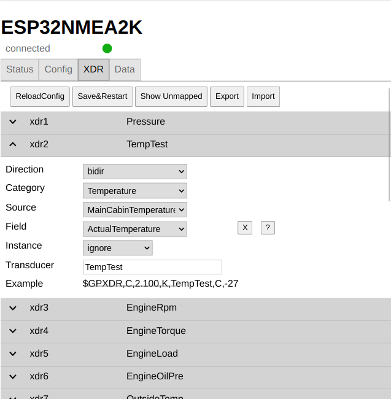
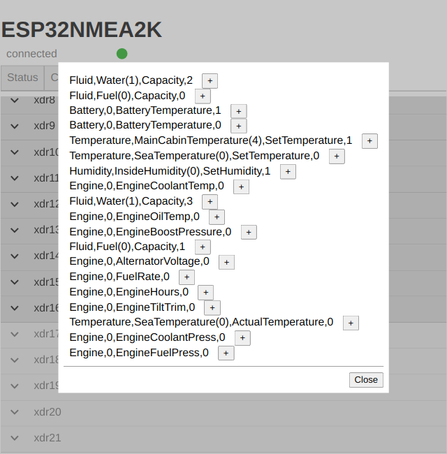

Converting to and from NMEA0183 XDR records
===========================================
Basics
------
NMEA2000 has a much broader set of messages dealing with various sensor data then NMEA0183 has.
In NMEA0183 there is (beside a small amount of predefined sentences) a more or less generic [XDR sentence](https://gpsd.gitlab.io/gpsd/NMEA.html#_xdr_transducer_measurement).
As there is no out of the box complete mapping between NMEA2000 and NMEA0183 XDR possible you need to configure the mappings between NMEA2000 and XDR and vice versa.

Mapping Parameters
------------------
Typically a NMEA2000 PGN that the gateway can map to an XDR record will belong to a certain category (like Temperature, Pressure, Engine,...), will potentially inlcude a source identifier (like SeaTemperature or OutsideTemperature), an instance id (0...255) and potentially a couple of fields (like EngineOilPressure, EngineCoolantTemp).
You now need to select which combination of those values should be mapped to a particular XDR transducer name.

Simple Set Up
-------------
To make the configuration easy the gateway will record information about NMEA2000 PGNs it could in principle map to XDR records - but without a current configuration.
Just click "Show Unmapped" to get a list of those entities.

By clicking the "+" button beside the entry you will get a prefilled mapping. You just need to add the transducer name and save the settings.

Instance Id handling
--------------------
For the instance Id of a NMEA2000 message there are 3 options on how they can be used to convert to a transducer name:
* single 
  exactly only this instance id is mapped to the selected transducer name.
  This should work for most receivers of the XDR records but requires a separate mapping for each of your instances.
* auto 
  In this mode the instance will be added to the transducer name in the form of Temperature#001 - 001 being the instance id. This is recommended in NMEA0183 4.x - but not necessarily received by all devices.
* ignore 
  All instances will map to the same transducer name.

Backward Mapping
----------------
The configured mappings can work in both directions. So when an XDR record with a known transducer name, type and unit is received it is converted into a NMEA2000 PGN.
You need to have the direction for the mapping set to "bidir" (the default).

Export and Import
-----------------
The mappings can be exported and imported as a json file from the UI.

Handled PGNs
------------
The following PGNS are handled:

| Category | from NMEA2000 | to NMEA2000 |
|----------|---------------|-------------|
| Fluid    | 127505        | 127505      |
| Battery  | 127508        | 127508      |
| Temperature | 130310, 130311, 130312, 130316     | 130312      |
| Pressure  | 130310, 130311, 130314 | 130314 |
| Humidity | 130311, 130313 | 130313 |
| Engine | 127489, 127488 | 127489, 127488 |

Rate
----
To avoid resending the same XDR transducer to often you can set a minimum delay between sending it again (config/converter/min XDR interval, default 100ms).
